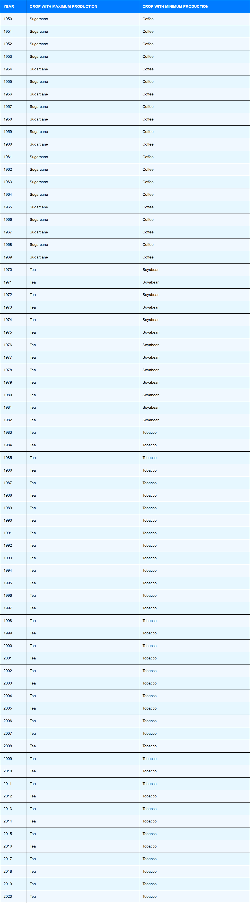
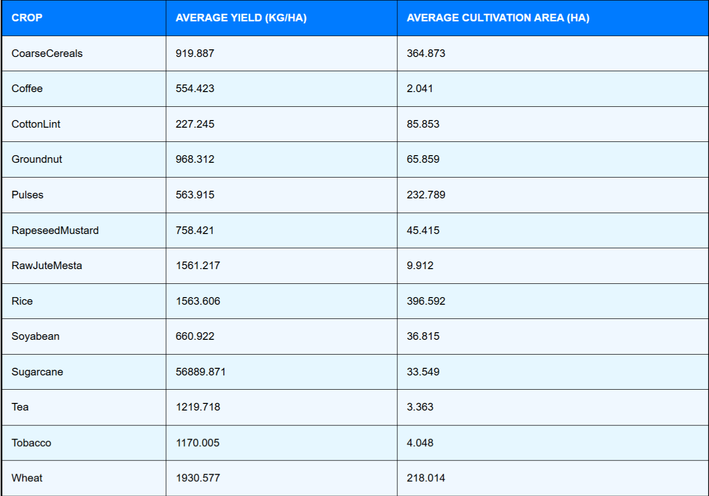

# Agriculture Data Analysis Project

This project analyzes agricultural data and displays it in tabular format using Mantine v7. 
It includes two tables implemented with Mantine's styling capabilities:

1. **Table 1**: Maximum and Minimum Production by Year.
2. **Table 2**: Average Yield and Cultivation Area by Crop.

---

## **Screenshots**

### Table 1: Maximum and Minimum Production by Year



### Table 2: Average Yield and Cultivation Area by Crop



---

## **How to Build/Run/Start the Project**

Follow the steps below to set up and run the project:

### 1. Prerequisites

Ensure you have the following installed on your system:
- Node.js (v14 or above)
- Yarn (v1.22 or above)

### 2. Clone the Repository

```bash
git clone <repository_url>
cd <repository_directory>
```

### 3. Install Dependencies

```bash
yarn install
```

### 4. Run the Development Server

```bash
yarn dev
```
### 5. Open the Application

After running the server, open your browser and navigate to:
```bash
http://localhost:5173
```
